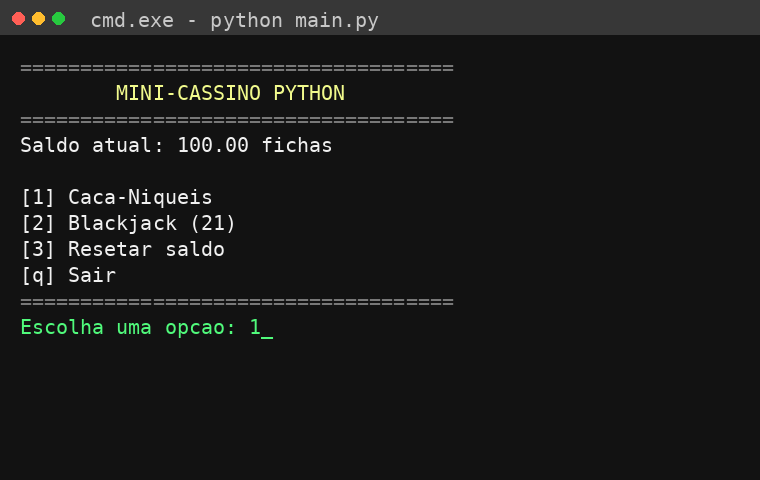

# 🎰 Mini-Cassino Python


Um mini-cassino de terminal escrito em Python, com **saldo persistente**, **sistema de apostas** e dois jogos completos: Caça-Níqueis e Blackjack (21).

Este projeto começou como um simples protótipo de caça-níqueis e evoluiu para uma aplicação modular, com regras de aposta, persistência de dados e organização de código em múltiplos arquivos — pensado tanto para praticar lógica de programação quanto para servir de peça de portfólio.

---

## 📋 Sumário

- [Demonstração](#-demonstração)
- [Funcionalidades](#-funcionalidades)
- [Como jogar](#-como-jogar)
- [Instalação](#-instalação)
- [Estrutura do projeto](#-estrutura-do-projeto)
- [Regras dos jogos](#-regras-dos-jogos)
- [Conceitos praticados](#-conceitos-praticados)
- [Roadmap](#-roadmap)

---

## 🎮 Demonstração



```
====================================
        🎰  MINI-CASSINO PYTHON  🎰
====================================
Saldo atual: 100.00 fichas

[1] Caça-Níqueis
[2] Blackjack (21)
[3] Resetar saldo
[q] Sair
====================================
Escolha uma opção:
```

## ✨ Funcionalidades

- 🎰 Caça-níqueis com multiplicadores diferentes por símbolo
- 🃏 Blackjack completo (compra de carta, dealer automático, blackjack natural)
- 💰 Sistema de apostas com validação de saldo
- 💾 Persistência do saldo em `saldo.json` (o progresso não se perde ao fechar)
- 🧩 Código modular, separado por responsabilidade (fácil de estender)

## ▶️ Como jogar

```bash
python3 main.py
```

O saldo inicial é de **100 fichas**. Escolha um jogo no menu, defina o valor da aposta e siga as instruções na tela. Ao sair (`q`), o saldo é salvo automaticamente e estará disponível na próxima execução.

## ⚙️ Instalação

Requisitos: **Python 3.10+** (não usa bibliotecas externas, só a biblioteca padrão).

```bash
# Clone o repositório
git clone https://github.com/ClevessonF/mini-cassino-python.git
cd mini-cassino-python

# Rode o jogo
python3 main.py
```

## 🗂 Estrutura do projeto

```
mini-cassino-python/
├── main.py           # Menu principal e loop do programa
├── saldo.py          # Persistência do saldo em saldo.json
├── caca_niquel.py     # Lógica e regras do caça-níqueis
├── blackjack.py       # Lógica e regras do blackjack
├── saldo.json          # Gerado automaticamente (ignorado pelo git)
├── .gitignore
└── README.md
```

## 🎲 Regras dos jogos

### Caça-Níqueis
| Resultado | Pagamento |
|---|---|
| 🍒 🍒 🍒 | 2x a aposta |
| 🍋 🍋 🍋 | 3x a aposta |
| 🍇 🍇 🍇 | 4x a aposta |
| 🔔 🔔 🔔 | 5x a aposta |
| ⭐ ⭐ ⭐ | 8x a aposta |
| 💎 💎 💎 | 15x a aposta |
| Dois símbolos iguais | 1.2x a aposta |
| Sem combinação | perde a aposta |

### Blackjack (21)
- Cartas numéricas valem seu número; J/Q/K valem 10; Ás vale 11 ou 1 (o que for melhor para a mão)
- O dealer compra cartas automaticamente até somar 17 ou mais
- Blackjack natural (21 nas duas primeiras cartas) paga **1.5x** a aposta
- Empate devolve a aposta; vitória normal paga **1x**

## 🧠 Conceitos praticados

- Estruturas de controle (`while`, `if/elif/else`)
- Módulo `random` (embaralhar cartas, sortear símbolos)
- Manipulação de arquivos e persistência de dados com `json`
- Organização em múltiplos módulos (separação de responsabilidades)
- Tratamento de entradas inválidas do usuário
- Simulação de regras de jogos de azar (probabilidade, payout)

## 🗺 Roadmap

Ideias para evoluir o projeto (contribuições são bem-vindas):

- [ ] Adicionar jogo de Roleta
- [ ] Histórico de jogadas (log de vitórias/derrotas)
- [ ] Sistema de "níveis de aposta" (mesas de valores diferentes)
- [ ] Testes automatizados com `pytest`
- [ ] Interface gráfica simples (ex: com `pygame` ou `tkinter`)

---

Feito com 🐍 Python.
